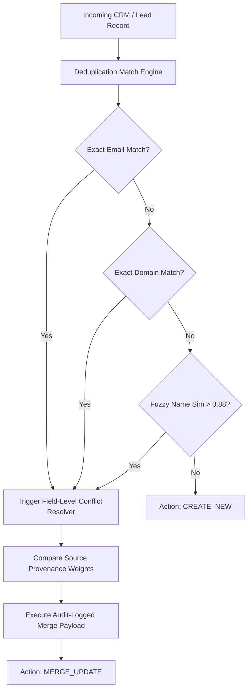

# GenPark AI Agent Skill - CRM Bidirectional Dedup & Sync Resolver

Deterministic CRM deduplication, fuzzy company reconciliation, and provenance-weighted field conflict resolution for B2B data synchronization.

Verified by [GenPark AI](https://genpark.ai) and compatible with [Model Context Protocol (MCP)](https://genpark.ai/mcp).

## Architecture Diagram

## Features
- **Multi-Level Deduplication Cascade**: Matches by primary work email, normalized website domain, and fuzzy string similarity.
- **Source-Weighted Conflict Arbiter**: Prevents lower-confidence enrichment vendors from clobbering verified CRM master data.
- **Zero External Dependencies**: Pure Python standard library implementation.
- **Ready for MCP Agents**: Seamlessly plugs into AI CRM integration swarms.
